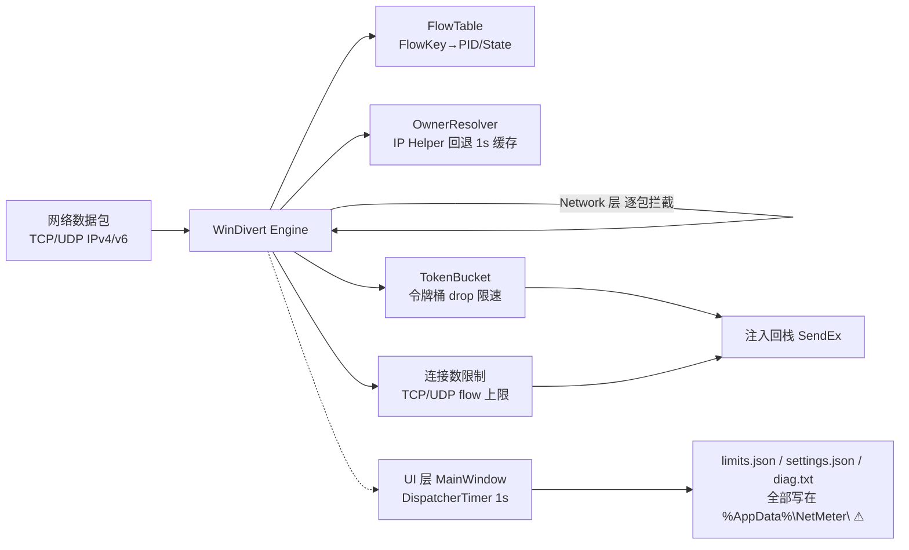

# NetMeter 代码审计与改进方案

> 基于 WinDivert 驱动的进程级网络监控与限速工具 · 源码安全与质量审计
> 审计范围：10 个源文件 / 约 1100 行 C#
> 技术栈：.NET 8 · WPF · WinDivert 2.2 · SharpDivert 1.1
> 日期：2026-08-16

---

## 一、执行摘要

NetMeter 整体架构清晰，对 WinDivert 双层（FLOW + Network）的使用、进程归属回退（IP Helper）、令牌桶限速等核心逻辑实现得相当专业。但在**长时间运行的稳定性、配置数据完整性、管理员权限下的文件安全**三方面存在必须修复的缺陷。本次共发现 **19 项问题**：

| 等级 | 数量 | 说明 |
|------|------|------|
| **P0 严重** | 4 | 内存泄漏、配置丢失、提权面、不可观测 |
| **P1 重要** | 7 | 句柄泄漏、吞吐瓶颈、UDP 限速无效、误归属等 |
| **P2 改进** | 8 | 体验、死代码、可维护性问题 |

### 核心结论

- **1 个确定的内存泄漏**：流归属表只增不减，长时间运行（尤其 UDP 场景）会持续膨胀。
- **1 个确定的配置丢失风险**：限制配置非原子写入，写入中途崩溃即全量丢失。
- **1 个提权攻击面**：以管理员身份向用户可写的 AppData 写文件，存在符号链接劫持风险。
- **1 个可观测性盲区**：数据包处理循环吞掉所有异常且无任何日志，故障不可诊断。
- 未发现可被远程利用的代码执行漏洞；JSON 反序列化仅处理简单值类型，无注入风险。

---

## 二、系统架构与数据流

理解数据流是理解风险的前提。NetMeter 用 WinDivert 在网络层"窃取"每个数据包，归属到进程后做限速/计数，再注入回协议栈。



**关键风险点**：Network 层用默认 flags（非 Sniff/RecvOnly），意味着每个数据包都被从协议栈取出，**必须 SendEx 注回**。若处理线程卡住或异常退出，**整机网络流量会被阻塞或丢包**。这是所有 WinDivert 限速工具的核心可靠性约束。

---

## 三、P0 严重问题（必须修复）

### P0-1 流归属表内存泄漏（PurgeStale 从未被调用）

**位置**：`FlowTable.cs:74`（定义）· 全项目无调用点

**问题**：`_owner`、`_lastSeen` 两个 `ConcurrentDictionary` 只在收到 WinDivert `FlowDeleted` 事件时清理。但：
- UDP flow 在 `FlowLoop` 中被显式 `continue` 跳过（WinDivertEngine.cs:188-196），**永远不会产生 FlowDeleted 事件**，因此 UDP 的归属条目只增不减。
- 通过 `OwnerResolver` 回退归属的预存连接（NetworkLoop.cs:271-289）也是只 `RegisterFlow` 不清理。
- 专为清理设计的 `PurgeStale()` 方法已实现，但**全项目无任何调用**（已用搜索确认）。

**影响**：长时间运行（尤其 P2P、浏览器、DNS 频繁场景）后字典条目数线性增长，内存持续上升，查找变慢，最终 OOM 或 CPU 飙高。确定性泄漏。

**修复方案**：在 `MainWindow.Refresh()`（每秒触发）中定期调用清理，并基于 `LastActivityTicks` 退役长期无活动的进程状态：

```csharp
// MainWindow.cs · Refresh() 内，计算 elapsed 之后加入：
_flowTable.PurgeStale(TimeSpan.FromMinutes(5));  // 清理 5 分钟无活动的流归属

// 退役完全无活动且无活动流量的 ProcessState（防止 _states 无限增长）
foreach (var pid in _flowTable.States.Keys
    .Where(p => _flowTable.States[p].LastActivityTicks < now.AddMinutes(-10).Ticks
              && _flowTable.States[p].TcpFlowCount == 0
              && _flowTable.States[p].UdpFlowCount == 0)
    .ToList())
{
    _flowTable.States.TryRemove(pid, out _);
    _engine.ForgetPid(pid);  // 顺带清理 PID→name 缓存（见 P1-4）
}
```

同时建议为 `PurgeStale` 增加单次清理条目上限（如每次最多 500 条），避免高负载时单次清理卡住 UI 线程。

---

### P0-2 限制配置非原子写入，崩溃即全量丢失

**位置**：`LimitsStore.cs:37` · `L.cs:684`

**问题**：`File.WriteAllText(_path, ...)` 直接覆盖目标文件。若写入过程中进程崩溃、断电、被强杀，`limits.json` 会变成**截断的半文件**。下次启动 `Load()` 的 `JsonSerializer.Deserialize` 抛异常被 catch，**返回空字典**——用户配置的所有限速规则全部丢失。

**影响**：用户数据丢失。对一款"配置驱动"的限速工具，配置丢失等于功能失效。

**修复方案**：采用"写临时文件 + 原子替换"模式（`File.Move` 在同卷下是原子操作）：

```csharp
// LimitsStore.cs
public void Save(IReadOnlyDictionary<string, LimitsConfig> limits)
{
    try
    {
        var dir = Path.GetDirectoryName(_path);
        if (!string.IsNullOrEmpty(dir)) Directory.CreateDirectory(dir);
        var json = JsonSerializer.Serialize(limits,
            new JsonSerializerOptions { WriteIndented = true });
        var tmp = _path + ".tmp";
        File.WriteAllText(tmp, json);
        // 同卷原子替换
        if (File.Exists(_path)) File.Replace(tmp, _path, destinationBackupFileName: null);
        else File.Move(tmp, _path);
    }
    catch { /* best-effort，但至少不会写半文件 */ }
}
```

同样修改 `L.Save()`（settings.json）。另建议 `Load()` 反序列化失败时**备份损坏文件**为 `limits.json.bad` 而非直接丢弃。

---

### P0-3 管理员进程向用户可写目录写文件：符号链接提权风险

**位置**：`LimitsStore.cs:12-15` · `L.cs:607-609` · `App.xaml.cs:7-9` · `MainWindow.cs:91-94/264-271`

**问题**：程序以 `requireAdministrator` 运行（app.manifest），但所有持久化文件都写在 `%AppData%\NetMeter\`——该目录普通用户可写。经典提权模式：低权限攻击者预先把 `diag.txt`/`limits.json` 创建为**符号链接**指向任意系统文件（如 `hosts`、关键 DLL），管理员进程的 `AppendAllText`/`WriteAllText` 会跟随链接写入，导致**任意文件覆盖/篡改**。

**影响**：本地提权（LPE）攻击面。结合 P0-2 的非原子写入，攻击者还能在 .tmp 阶段做 TOCTOU 竞争。

**修复方案**：
- **迁移存储位置**到 `%ProgramData%\NetMeter\`，首次创建目录时设置 ACL：仅 Administrators 可写、Users 只读。
- **写入前校验非符号链接**，拒绝跟随重解析点：

```csharp
private static void EnsureSafeFile(string path)
{
    if (!File.Exists(path)) return;
    var info = new FileInfo(path);
    if ((info.Attributes & FileAttributes.ReparsePoint) != 0)
        throw new InvalidOperationException("拒绝写入符号链接: " + path);
}
// 在每次 WriteAllText / AppendAllText 之前调用 EnsureSafeFile(path)
```

- **诊断日志**（diag.txt）尤其危险（每秒写、含网络元数据），建议改为环形内存日志或写入 ProgramData 并加 ACL。

---

### P0-4 数据包处理循环吞掉所有异常且无日志，故障不可诊断

**位置**：`WinDivertEngine.cs:227-230` / `322-325`

**问题**：`FlowLoop` 与 `NetworkLoop` 的异常处理：

```csharp
catch (Exception) when (ct.IsCancellationRequested) { break; }
catch { Thread.Sleep(50); }   // 所有非取消异常一概吞掉
```

`NullReferenceException`、`OutOfMemoryException`、句柄失效、驱动卸载等**全部被静默忽略**，仅 Sleep 后重试。引擎可能在内部状态损坏后继续运行产出错误数据，且 `diag.txt` 从不记录异常。

**影响**：可观测性盲区。配合 P1-5 的忙等，可能出现"引擎假死但无任何报错"的疑难场景。

**修复方案**：

```csharp
private int _networkErrors;
catch (Exception) when (ct.IsCancellationRequested) { break; }
catch (WinDivertException wd)
{
    DiagLog.Warn($"NetworkLoop WinDivert error {wd.NativeErrorCode}: {wd.Message}");
    if (Interlocked.Increment(ref _networkErrors) > 100)
    {
        DiagLog.Error("NetworkLoop 连续失败超限，停止引擎");
        break;  // 触发自停，避免无限忙等
    }
    Thread.Sleep(10);
}
catch (Exception ex)
{
    DiagLog.Error($"NetworkLoop unhandled: {ex}");
    Thread.Sleep(10);
}
```

引入轻量 `DiagLog`（写 ProgramData，见 P0-3），区分可恢复/不可恢复错误，连续失败超阈值时主动停止引擎并通知 UI。

---

## 四、P1 重要问题（建议尽快修复）

### P1-1 CancellationTokenSource 泄漏（Stop/Start 循环）

**位置**：`WinDivertEngine.cs:48`（创建）· `149`（Stop 仅 Cancel 不 Dispose）· `484`（仅 Dispose 释放一次）

`Start()` 每次创建新 CTS，`Stop()` 只 `Cancel()` 不 Dispose 旧的。用户反复点"停止/开始监控"，每个 CTS 内部持内核事件句柄，**逐次泄漏**。

```csharp
// Start() 开头：
_cts?.Dispose();          // 释放上一次的（已 Cancel 的）
_cts = new CancellationTokenSource();
```

---

### P1-2 单线程网络处理 + TokenBucket 锁，成为全网流量瓶颈

**位置**：`WinDivertEngine.cs:234`（单 NetworkLoop）· `Models.cs:92`（TokenBucket lock）· `OwnerResolver.cs:80`（刷新锁）

所有数据包在单个 `NetworkLoop` 线程内串行处理：解析 → 多次字典查找 → `TokenBucket.TryConsume`（带 lock）→ 计数 → `SendEx`。高吞吐时：
- `TokenBucket` 的 `lock(_gate)` 虽当前单线程无竞争，但限速进程多时仍是串行临界区。
- `OwnerResolver.RefreshIfStale` 每秒一次同步 `AllocHGlobal`+全表重建，在数据包线程上执行，造成**延迟尖峰**。
- 任何一次处理慢，`WinDivert` 队列堆积，超出 `QueueLength=16384` 即**丢包**。

**影响**：高负载下整机网络延迟上升、吞吐下降，表现为"开了 NetMeter 网就卡"。

**改进方向**：① OwnerResolver 后台预刷新（双缓冲，消除热路径 AllocHGlobal）；② 令牌桶无锁化（Interlocked 定点整数）；③ 分片处理（按流哈希开多 NetworkLoop 线程）；④ 限速决策与非关键计数分离，确保 SendEx 路径最短。

---

### P1-3 UDP 限速采用 drop-based，对该协议无效

**位置**：`WinDivertEngine.cs:401-425`（注释自述"TCP self-regulates"）

限速靠丢包：令牌桶空就 `return false` 丢包。TCP 有效（拥塞控制自动减速），但 **UDP 无拥塞控制**——发送方不会因丢包减速，只会持续重发或应用层超时。结果：UDP 限速时几乎所有包被丢，应用可能完全通信失败，而非"平稳限速"。

**影响**：UDP 限速体验差，可能误判为"限速功能坏了"。视频流、QUIC、游戏流量受影响大。

**改进方向**：对 UDP 改用延迟注入（暂存超速包，等令牌恢复后再 SendEx）；或在 UI 明确提示"UDP 限速为硬丢弃模式"；QUIC 有类似 TCP 拥塞控制，drop 对其部分有效，可特殊处理。

---

### P1-4 PID→进程名缓存永不清理，PID 复用导致误归属

**位置**：`FlowTable.cs:14`（`_pidNames`）· `91-132`（ResolveProcessName）

`_pidNames` 缓存 PID→进程名，进程退出后 PID 被系统复用给新进程，但缓存仍返回旧名。**导致新进程流量被错误计入旧进程名**，限速规则也可能误触发。

在 P0-1 的进程退役逻辑中加入 `_pidNames.TryRemove(pid, out _)`；另可校验：取进程名前用 `Process.GetProcessById` 探活，失败即清缓存。

---

### P1-5 异常重试无上限，形成不可恢复的忙等循环

**位置**：`WinDivertEngine.cs:227-230` / `322-325`

当 RecvEx 因驱动卸载、句柄无效等**不可恢复**原因持续抛异常时，`catch { Sleep(50) }` 会无限重试，CPU 空转且无恢复希望。应与 P0-4 联动：连续失败计数超阈值即停止引擎，通知 UI 切换为"已停止/故障"，让用户手动重启而非静默空耗。

---

### P1-6 限速口径与计数口径不一致

**位置**：`WinDivertEngine.cs:418`（按 payloadLength 消费令牌）· `311-313`（按 packet.Length 计数显示）

令牌桶消费用应用层负载 `payloadLength`，但速率显示计数用整包长度 `packet.Length`（含 IP+TCP 头）。结果：设限 1000 KB/s 时实际允许的应用数据略多于 1000，而显示速率又含头部，**显示值会持续略高于限速阈值**。统一为同口径（建议都用整包长度，与任务管理器一致），或文档明确说明。

---

### P1-7 诊断日志明文记录网络元数据，存在信息泄露

**位置**：`MainWindow.cs:255-281`（WriteDiag 每秒写）· `App.xaml.cs:24-33` · `WinDivertEngine.cs:379-396`（GetDiag 含 IP/端口/进程）

`diag.txt` 每秒追加，内容含进程名、远端 IP、端口、连接数等敏感网络行为画像，明文存于 AppData。任何能读该用户 AppData 的程序都能获取完整网络活动轨迹。且有 300KB 截断但无 ACL、无轮转策略。

**影响**：隐私泄露。配合 P0-3 的符号链接问题更严重。

迁移到 ProgramData 加 ACL（见 P0-3）；默认关闭详细 IP 记录，仅保留聚合统计；或改为内存环形缓冲，仅"导出诊断"时落盘。

---

## 五、P2 代码质量与体验改进

| 编号 | 问题 | 位置 | 说明 |
|------|------|------|------|
| **P2-1** | FilterBox 输入无防抖 | `MainWindow.cs:250-253` | 每次按键触发完整 Refresh，快速输入卡顿。加 150-250ms 防抖 |
| **P2-2** | DataGrid 每秒重建丢选中/滚动 | `MainWindow.cs:206` | 整体替换 ItemsSource 重置选中态。改用 ObservableCollection 增量更新 |
| **P2-3** | `_stateByNameCache` 死代码 | `FlowTable.cs:16/32-34` | 仅 Clear 无任何读取（已搜索确认）。直接删除字段与 lock |
| **P2-4** | GetTrackedStates 每秒 ToList + IsProcessRunning O(n²) | `FlowTable.cs:72` · `MainWindow.cs:181` | 每秒拷贝全量；限制对话框每行再遍历。维护进程名集合或 HashSet |
| **P2-5** | catch(Exception) 过宽 | 多处 | 多处 `catch { }` 静默吞异常。至少记录 IO 错误 |
| **P2-6** | XAML 硬编码中文初始值 | `MainWindow.xaml:4,47-77` | 非中文系统首次启动闪烁。改用 x:Static 或留空由代码设置 |
| **P2-7** | 无代码签名，SmartScreen 拦截 | `NetMeter.csproj` | 管理员程序无签名会被拦截。配置签名 |
| **P2-8** | Stop 超时未强制终止留悬空任务 | `WinDivertEngine.cs:150-151` | Wait(3s) 超时后直接 Dispose handle，任务可能仍卡阻塞 RecvEx。超时后记录告警并保顺序安全 |

---

## 六、修复路线图

建议分三阶段推进，每阶段可独立验证、独立发布。

### 阶段一 · 紧急修复（1-2 天）
- P0-1 调用 PurgeStale + 进程退役
- P0-2 配置原子写入
- P0-3 存储迁移 ProgramData + 符号链接校验
- P0-4 异常分级 + 诊断日志
- P1-1 CTS 泄漏修复

**目标**：消除内存泄漏、数据丢失、提权面

### 阶段二 · 稳健性（3-5 天）
- P1-2 OwnerResolver 后台刷新
- P1-4 PID 缓存清理
- P1-5 失败计数上限
- P1-6 限速口径统一
- P1-7 日志降级与 ACL
- P2-3 删除死代码

**目标**：长时间运行稳定、可观测

### 阶段三 · 体验与性能（按需）
- P1-3 UDP 限速改进
- P1-2 令牌桶无锁化/分片
- P2-1 FilterBox 防抖
- P2-2 DataGrid 增量更新
- P2-4 查询优化
- P2-6/7 资源化 + 签名

**目标**：高吞吐性能、用户体验

---

## 七、安全审计结论

| 检查项 | 结论 | 说明 |
|--------|------|------|
| 远程代码执行 (RCE) | ✅ 未发现 | 无远程监听、无外部输入反序列化复杂对象 |
| JSON 反序列化 | ✅ 安全 | LimitsConfig 仅含值类型，无多态/类型劫持面 |
| 本地提权 (LPE) | 🔴 存在面 | P0-3 管理员进程写 AppData，符号链接劫持 |
| 缓冲区/内存安全 | 🟠 基本安全 | unsafe 指针解析有长度约束；P0-1 为泄漏非安全问题 |
| P/Invoke 边界 | 🟠 基本正确 | SCM/kernel32/iphlpapi 参数匹配；DeleteDriverService 可改进 |
| 信息泄露 | 🟠 中等 | P1-7 diag.txt 明文记录网络元数据 |
| 权限边界 | 🟠 可接受 | requireAdministrator 合理（驱动安装需要） |
| 供应链 | ✅ 正常 | SharpDivert / Native.WinDivert 已知包，建议固定版本 |

**总体安全评级：中风险**。无致命远程漏洞，但本地提权面与信息泄露需在阶段一/二关闭。修复 P0-3 与 P1-7 后可降至低风险。

---

*NetMeter 代码审计报告 · 共 19 项发现（4 P0 / 7 P1 / 8 P2）· 生成于 2026-08-16*
*本报告基于静态源码审查，建议结合动态测试（高负载压测、长时间运行内存采样、符号链接 PoC）验证。*
